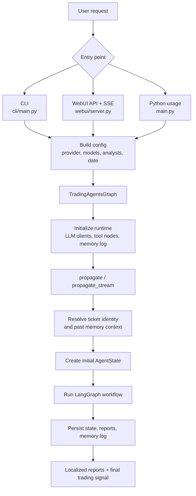
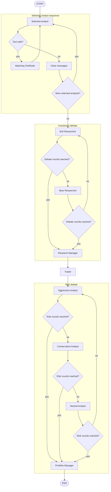
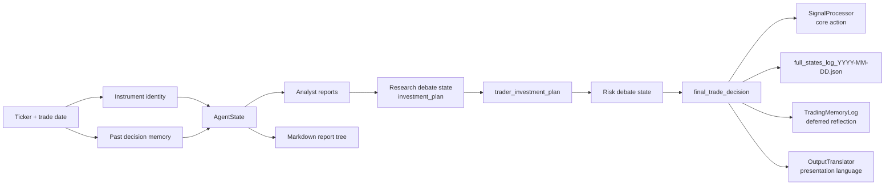

# TradingAgents Project Flow Diagram

This document is a developer-onboarding map for the current TradingAgents
runtime. It explains how a request moves from the CLI, WebUI, or Python API into
the LangGraph workflow, which agents run, which state fields they produce, which
tools they can call, and where the outputs are persisted.

Start here when changing orchestration, adding an analyst, debugging missing
reports, or tracing why a final trading signal was produced.

## Top-Level Runtime Flow



## Entry Points

| Entry point | File | Graph call | Notes |
| --- | --- | --- | --- |
| Interactive CLI | `cli/main.py` | `TradingAgentsGraph(..., debug=True).propagate(...)` | Collects ticker, date, analysts, LLM provider/models, research depth, language, and optional checkpoint flag. Displays live Rich panels and writes CLI logs/reports. |
| WebUI | `webui/server.py` | `TradingAgentsGraph(..., debug=False).propagate_stream(...)` | Accepts JSON config, runs analysis in a worker thread, streams progress/report events over SSE, tracks run history when enabled. |
| Python API | `main.py` or user code | `TradingAgentsGraph(...).propagate(...)` | Direct programmatic usage. Call `save_reports(...)` separately if a report tree is needed. |

All entry points eventually construct `TradingAgentsGraph` with:

- `selected_analysts`: subset of `market`, `social`, `news`, `fundamentals`.
- `config`: normally based on `DEFAULT_CONFIG`, optionally overridden by
  `TRADINGAGENTS_*` environment variables and UI/CLI selections.
- `callbacks`: optional LangChain callback handlers for LLM/tool telemetry.

## LangGraph Agent Flow

The selected analyst stages are dynamic, but they run in the configured order
from `build_analyst_execution_plan`: market, sentiment, news, fundamentals.
Each selected analyst can loop through its tool node until no more tool calls
are requested.



## Concrete Node Order

`GraphSetup.setup_graph(...)` creates a `StateGraph(AgentState)`. The analyst
portion is dynamic, but the rest of the graph always runs.

| Phase | Node name | Created by | LLM | Primary output |
| --- | --- | --- | --- | --- |
| Analyst | `Market Analyst` | `create_market_analyst` | quick | `market_report` |
| Analyst | `Sentiment Analyst` | `create_sentiment_analyst` | quick | `sentiment_report` |
| Analyst | `News Analyst` | `create_news_analyst` | quick | `news_report` |
| Analyst | `Fundamentals Analyst` | `create_fundamentals_analyst` | quick | `fundamentals_report` |
| Cleanup | `Msg Clear Market` / `Msg Clear Sentiment` / `Msg Clear News` / `Msg Clear Fundamentals` | `create_msg_delete` | none | Clears transient tool-chat messages before the next analyst |
| Research | `Bull Researcher` | `create_bull_researcher` | quick | `investment_debate_state.bull_history` |
| Research | `Bear Researcher` | `create_bear_researcher` | quick | `investment_debate_state.bear_history` |
| Research | `Research Manager` | `create_research_manager` | deep | `investment_debate_state.judge_decision`, `investment_plan` |
| Trading | `Trader` | `create_trader` | quick | `trader_investment_plan` |
| Risk | `Aggressive Analyst` | `create_aggressive_debator` | quick | `risk_debate_state.aggressive_history` |
| Risk | `Conservative Analyst` | `create_conservative_debator` | quick | `risk_debate_state.conservative_history` |
| Risk | `Neutral Analyst` | `create_neutral_debator` | quick | `risk_debate_state.neutral_history` |
| Portfolio | `Portfolio Manager` | `create_portfolio_manager` | deep | `risk_debate_state.judge_decision`, `final_trade_decision` |

Quick and deep LLM instances are created once in
`TradingAgentsGraph.__init__` through `create_llm_client(...)`. Provider-specific
thinking options are passed by `_get_provider_kwargs()`.

## Routing Rules

Routing lives in `tradingagents/graph/conditional_logic.py`.

| Router | Input inspected | Destination |
| --- | --- | --- |
| `should_continue_market` | Last message has tool calls | `tools_market`; otherwise `Msg Clear Market` |
| `should_continue_social` | Last message has tool calls | `tools_social`; otherwise `Msg Clear Sentiment` |
| `should_continue_news` | Last message has tool calls | `tools_news`; otherwise `Msg Clear News` |
| `should_continue_fundamentals` | Last message has tool calls | `tools_fundamentals`; otherwise `Msg Clear Fundamentals` |
| `should_continue_debate` | `investment_debate_state.count` and latest response speaker | Alternates Bull/Bear until `2 * max_debate_rounds`, then `Research Manager` |
| `should_continue_risk_analysis` | `risk_debate_state.count` and latest speaker | Rotates Aggressive/Conservative/Neutral until `3 * max_risk_discuss_rounds`, then `Portfolio Manager` |

## Analyst Tool Mapping

Tool nodes are created in `TradingAgentsGraph._create_tool_nodes()`. Analysts can
request these tools through LangGraph `ToolNode`s; if they do, the tool node
returns to the same analyst for another LLM turn.

| Tool node | Analyst | Tools |
| --- | --- | --- |
| `tools_market` | `Market Analyst` | `get_stock_data`, `get_indicators`, `get_verified_market_snapshot` |
| `tools_social` | `Sentiment Analyst` | `get_news` |
| `tools_news` | `News Analyst` | `get_news`, `get_global_news`, `get_insider_transactions`, `get_macro_indicators`, `get_prediction_markets` |
| `tools_fundamentals` | `Fundamentals Analyst` | `get_fundamentals`, `get_balance_sheet`, `get_cashflow`, `get_income_statement` |

Most tool implementations route through `tradingagents/agents/utils/*_tools.py`
and the vendor adapters in `tradingagents/dataflows/`. Vendor selection comes
from `config["data_vendors"]` and `config["tool_vendors"]`.

## Data and Output Flow



## AgentState Fields

`Propagator.create_initial_state(...)` constructs the initial state. Agents then
append reports and debate decisions as the graph progresses.

| Field | Initialized from | Updated by | Purpose |
| --- | --- | --- | --- |
| `messages` | Human message containing ticker | Analysts and tool nodes | LangChain message history for active tool-calling loops |
| `company_of_interest` | Requested ticker | immutable during run | Main symbol under analysis |
| `asset_type` | Entry point, usually `stock` or `crypto` | immutable during run | Lets prompts/tools adapt to stocks vs crypto |
| `instrument_context` | `resolve_instrument_context(...)` | immutable during run | Deterministic identity string so agents do not infer the wrong company |
| `trade_date` | Requested analysis date | immutable during run | Date boundary used by tools and prompts |
| `past_context` | `TradingMemoryLog.get_past_context(...)` | immutable during run | Prior same-ticker decisions and cross-ticker lessons |
| `market_report` | empty string | `Market Analyst` | Technical/market report |
| `sentiment_report` | empty string | `Sentiment Analyst` | News/social sentiment report |
| `news_report` | empty string | `News Analyst` | News, macro, insider, prediction-market report |
| `fundamentals_report` | empty string | `Fundamentals Analyst` | Fundamentals report |
| `investment_debate_state` | empty debate state | Bull, Bear, Research Manager | Research debate histories and manager decision |
| `investment_plan` | absent/empty until produced | `Research Manager` | Research-team investment plan |
| `trader_investment_plan` | absent/empty until produced | `Trader` | Concrete trading plan |
| `risk_debate_state` | empty risk debate state | Aggressive, Conservative, Neutral, Portfolio Manager | Risk debate histories and final risk judgment |
| `final_trade_decision` | absent/empty until produced | `Portfolio Manager` | Final decision parsed into a core signal |

## Run Lifecycle

1. `TradingAgentsGraph.__init__` copies config, forces internal agent language to
   English, creates cache/result directories, builds quick/deep LLM clients,
   creates tool nodes, builds the workflow, and compiles the graph.
2. `propagate(...)` or `propagate_stream(...)` sets the ticker and resolves any
   pending memory-log entries for that same ticker.
3. If `checkpoint_enabled` is true, the workflow is recompiled with a
   per-ticker SQLite checkpointer and the ticker/date thread ID is injected into
   graph config.
4. `_run_graph(...)` or the streaming body fetches past memory context, resolves
   instrument identity, creates initial `AgentState`, and invokes/streams the
   LangGraph workflow.
5. The final state is stored in `self.curr_state`, logged to JSON, and written
   to `TradingMemoryLog` as a pending decision.
6. Successful checkpointed runs delete the ticker/date checkpoint rows so future
   runs do not resume stale state.
7. `process_signal(...)` extracts the core action from `final_trade_decision`.
8. `localize_output(...)` translates returned/displayed state copies when the
   requested output language is not English.

## Persistence and Files

| Output | Writer | Default location |
| --- | --- | --- |
| Full state JSON | `TradingAgentsGraph._log_state` | `~/.tradingagents/logs/<TICKER>/TradingAgentsStrategy_logs/full_states_log_<DATE>.json` |
| CLI live message/tool log | `cli/main.py` | `~/.tradingagents/logs/<TICKER>/<DATE>/message_tool.log` |
| CLI section reports | `cli/main.py` | `~/.tradingagents/logs/<TICKER>/<DATE>/reports/*.md` |
| Report tree | `write_report_tree(...)` | CLI: `~/.tradingagents/logs/<TICKER>/<DATE>/reports`; API default: `~/.tradingagents/logs/reports/<TICKER>_<TIMESTAMP>` |
| Memory log | `TradingMemoryLog` | `~/.tradingagents/memory/trading_memory.md` |
| Checkpoints | `tradingagents/graph/checkpointer.py` | `~/.tradingagents/cache/checkpoints/<TICKER>.db` |
| WebUI analysis history | `AnalysisHistoryStore` | `~/.tradingagents/logs/analysis_history` unless configured otherwise |

The base directories can be overridden with `TRADINGAGENTS_RESULTS_DIR`,
`TRADINGAGENTS_CACHE_DIR`, and `TRADINGAGENTS_MEMORY_LOG_PATH`.

## Report Tree Layout

`tradingagents/reporting.py` writes a normalized report tree for completed runs:

```text
reports/
  1_analysts/
    market.md
    sentiment.md
    news.md
    fundamentals.md
  2_research/
    bull.md
    bear.md
    manager.md
  3_trading/
    trader.md
  4_risk/
    aggressive.md
    conservative.md
    neutral.md
  5_portfolio/
    decision.md
  complete_report.md
```

Files are only written when the corresponding state content exists.

## Configuration That Changes Flow

| Config key | Effect |
| --- | --- |
| `selected_analysts` constructor argument | Chooses which analyst nodes run. At least one is required. |
| `max_debate_rounds` | Controls Bull/Bear debate length. |
| `max_risk_discuss_rounds` | Controls Aggressive/Conservative/Neutral debate length. |
| `max_recur_limit` | LangGraph recursion limit, important when tool loops or debates grow. |
| `checkpoint_enabled` | Enables resumable LangGraph checkpoints for ticker/date runs. |
| `llm_provider`, `quick_think_llm`, `deep_think_llm`, `backend_url` | Select provider/model clients. |
| `output_language` | Translates presentation output only; internal agent state remains English. |
| `data_vendors`, `tool_vendors` | Select market/news/fundamental/macro/prediction data adapters. |
| `benchmark_ticker`, `benchmark_map`, crypto benchmark keys | Affect realized-return reflection stored in memory. |

Environment overrides are centralized in `tradingagents/default_config.py` under
`_ENV_OVERRIDES`.

## Checkpoint Resume Details

Checkpointing is off by default. When enabled:

- `get_checkpointer(data_cache_dir, ticker)` opens
  `cache/checkpoints/<SAFE_TICKER>.db`.
- `thread_id(ticker, date)` creates a stable ticker/date thread ID.
- LangGraph writes node checkpoints into SQLite through `SafeSqliteSaver`.
- A later run with the same ticker/date can resume from the latest saved step.
- After a successful run, `clear_checkpoint(...)` removes rows for that
  ticker/date to avoid accidental stale resumes.
- CLI supports `--checkpoint`, `--no-checkpoint`, and `--clear-checkpoints`.
- WebUI exposes checkpoint as a request field.

## Adding or Changing Flow

Use this checklist when modifying orchestration:

1. Add new agent state fields in `tradingagents/agents/utils/agent_states.py`.
2. Add or update agent factory imports and nodes in `tradingagents/graph/setup.py`.
3. If it is an analyst, update `ANALYST_NODE_SPECS` in
   `tradingagents/graph/analyst_execution.py`.
4. Add routing logic in `tradingagents/graph/conditional_logic.py` when the new
   node has loops or conditional transitions.
5. Add tools in `TradingAgentsGraph._create_tool_nodes()` if the node needs
   tool access.
6. Update CLI/WebUI status/report mappings when a new report or visible stage
   is introduced.
7. Update `tradingagents/reporting.py` when the new output should be persisted.
8. Add focused tests under `tests/`, mocking external vendors for routine unit
   runs.

## Main Components

- `TradingAgentsGraph`: owns LLM clients, tool nodes, LangGraph compilation,
  propagation, checkpoint handling, localization, logging, and signal parsing.
- `GraphSetup`: builds the LangGraph `StateGraph` and wires all agent and tool
  nodes.
- `ConditionalLogic`: routes analyst tool loops, bull/bear debate turns, and
  risk-debate turns.
- `Propagator`: creates the initial `AgentState` and graph invocation config.
- `ToolNode`s: expose market, sentiment, news, macro, prediction-market, and
  fundamentals tools to analyst agents.
- `TradingMemoryLog`: stores previous decisions and later enriches them with
  realized returns and reflections.
- `OutputTranslator`: translates presentation copies while keeping graph agents
  operating in canonical English.
